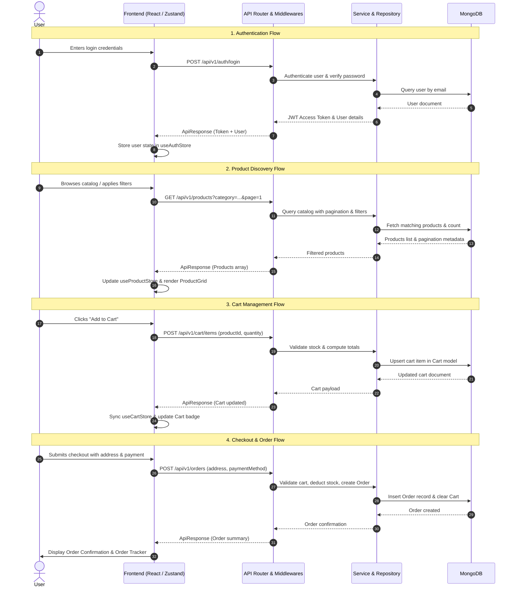

# 🛍️ HorizonTechX ShopNest — Full-Stack E-Commerce Platform

A production-ready, full-stack E-Commerce web application built with a **modular MERN stack** (MongoDB, Express.js, React 19, Node.js). Designed with **Clean Layered Architecture (Controller-Service-Repository pattern)** on the backend and **Zustand + Tailwind CSS v4** on the frontend for high scalability, maintainability, and enterprise-grade code organization.

---

## 📑 Table of Contents
1. [Project Overview](#-project-overview)
2. [Tech Stack](#-tech-stack)
3. [Full Project Directory Structure](#-full-project-directory-structure)
4. [Architecture & Design Patterns](#-architecture--design-patterns)
5. [End-to-End System Workflow](#-end-to-end-system-workflow)
6. [API Specifications & Contracts](#-api-specifications--contracts)
7. [Database Models & Schemas](#-database-models--schemas)
8. [Environment Configuration](#-environment-configuration)
9. [Local Development Setup](#-local-development-setup)
10. [Security & Best Practices](#-security--best-practices)

---

## 🌟 Project Overview

**HorizonTechX ShopNest** is an end-to-end e-commerce solution offering seamless shopping experiences:
- **Authentication & Authorization**: Secure JWT-based auth with refresh tokens, password hashing (bcrypt), and role-based access control (User/Admin).
- **Product Catalog & Discovery**: Categorization, multi-filter search (price, rating, category), pagination, and image gallery.
- **Cart Management**: Persistent shopping cart synced with backend database and optimistic client-side UI updates.
- **Order Management & Tracking**: Multi-step checkout, order summary, order status tracking (Pending → Processing → Shipped → Delivered).
- **Responsive & Modern UI**: Built with React 19, Tailwind CSS v4, Lucide Icons, and React Hot Toast.

---

## 🛠️ Tech Stack

### 🖥️ Frontend (`HorizonTechX_ShopNest_frontend`)
- **Core**: [React 19](https://react.dev/), [Vite](https://vitejs.dev/)
- **Routing**: [React Router DOM v7](https://reactrouter.com/)
- **Styling**: [Tailwind CSS v4](https://tailwindcss.com/)
- **State Management**: [Zustand](https://github.com/pmndrs/zustand)
- **HTTP Client**: [Axios](https://axios-http.com/)
- **Icons & Notifications**: [Lucide React](https://lucide.dev/), [React Hot Toast](https://react-hot-toast.com/)

### ⚙️ Backend (`HorizonTechX_ShopNest_backend`)
- **Runtime & Framework**: [Node.js](https://nodejs.org/) (ES Modules), [Express.js](https://expressjs.com/)
- **Database & ODM**: [MongoDB](https://www.mongodb.com/), [Mongoose](https://mongoosejs.com/)
- **Authentication**: [JSON Web Token (JWT)](https://jwt.io/), [bcryptjs](https://github.com/dcodeIO/bcrypt.js)
- **File Uploads & Media Storage**: [Multer](https://github.com/expressjs/multer), [Cloudinary SDK](https://cloudinary.com/)
- **Validation & Sanitization**: [express-validator](https://express-validator.github.io/docs/)
- **Security & Utilities**: [Helmet](https://helmetjs.github.io/), [CORS](https://github.com/expressjs/cors), [express-rate-limit](https://github.com/express-rate-limit/express-rate-limit), [Compression](https://github.com/expressjs/compression), [Morgan](https://github.com/expressjs/morgan)

---

## 📂 Full Project Directory Structure

```text
HorizonTechX_ShopNest/
│
├── HorizonTechX_ShopNest_backend/          # Backend REST API (Node/Express/MongoDB)
│   ├── src/
│   │   ├── config/                         # Configuration modules
│   │   │   ├── cloudinary.config.js        # Cloudinary setup for media uploads
│   │   │   ├── db.js                       # Mongoose MongoDB connection logic
│   │   │   └── env.config.js               # Centralized environment variable loader
│   │   │
│   │   ├── controllers/                    # Request/Response orchestration layer
│   │   │   ├── auth.controller.js          # User auth, login, register, profile
│   │   │   ├── cart.controller.js          # Cart CRUD & synchronization
│   │   │   ├── order.controller.js         # Order creation, details, list, tracking
│   │   │   └── product.controller.js       # Products catalog & management
│   │   │
│   │   ├── services/                       # Core business logic layer
│   │   │   ├── auth.service.js             # Credentials verification, token generation
│   │   │   ├── cart.service.js             # Cart calculations, stock validation
│   │   │   ├── order.service.js            # Checkout workflows, inventory adjustments
│   │   │   └── product.service.js          # Product search, filter, upload logic
│   │   │
│   │   ├── repositories/                   # Data Access Layer (Mongoose queries)
│   │   │   ├── cart.repository.js          # Cart DB operations
│   │   │   ├── order.repository.js         # Order DB operations
│   │   │   ├── product.repository.js       # Product DB operations
│   │   │   └── user.repository.js          # User DB operations
│   │   │
│   │   ├── models/                         # Database Schemas (Mongoose)
│   │   │   ├── Cart.model.js               # Cart items, quantities, totals
│   │   │   ├── Category.model.js           # Categories & classifications
│   │   │   ├── Order.model.js              # Order items, shipping, payment, status
│   │   │   ├── Product.model.js            # Product details, pricing, images, stock
│   │   │   └── User.model.js               # User credentials, role, addresses
│   │   │
│   │   ├── routes/                         # API Route Definitions
│   │   │   ├── auth.routes.js              # /api/v1/auth routes
│   │   │   ├── cart.routes.js              # /api/v1/cart routes
│   │   │   ├── order.routes.js             # /api/v1/orders routes
│   │   │   ├── product.routes.js           # /api/v1/products routes
│   │   │   └── index.js                    # Main router mounting all endpoints
│   │   │
│   │   ├── middlewares/                    # Custom Express Middlewares
│   │   │   ├── auth.middleware.js          # JWT authentication & role-based authorization
│   │   │   ├── error.middleware.js         # Global centralized error handler
│   │   │   ├── sanitize.middleware.js      # Input sanitization middleware
│   │   │   ├── upload.middleware.js        # Multer disk/memory storage for uploads
│   │   │   └── validate.middleware.js      # Express-validator error collector
│   │   │
│   │   ├── validators/                     # Request Validation Rules
│   │   │   ├── auth.validator.js           # Validation schemas for login & register
│   │   │   ├── order.validator.js          # Validation schemas for checkout/order
│   │   │   └── product.validator.js        # Validation schemas for product payloads
│   │   │
│   │   ├── utils/                          # Helper Utilities
│   │   │   ├── ApiError.js                 # Standardized operational error class
│   │   │   ├── ApiResponse.js              # Standardized API response structure
│   │   │   ├── asyncHandler.js             # Higher-order async route wrapper
│   │   │   ├── generateToken.js            # Access & Refresh JWT generator
│   │   │   └── pagination.js               # Pagination & query parsing helper
│   │   │
│   │   ├── app.js                          # Express application initialization & middleware
│   │   └── server.js                       # Server entry point & DB bootstrap
│   │
│   ├── .env.example                        # Template for backend environment variables
│   ├── package.json                        # Backend dependencies & npm scripts
│   └── package-lock.json
│
├── HorizonTechX_ShopNest_frontend/         # Client Single Page Application (React 19 + Vite)
│   ├── src/
│   │   ├── api/                            # API Services (Axios)
│   │   │   ├── axios.js                    # Axios instance with interceptors
│   │   │   ├── authApi.js                  # Authentication API endpoints
│   │   │   ├── cartApi.js                  # Cart API endpoints
│   │   │   ├── orderApi.js                 # Orders API endpoints
│   │   │   └── productApi.js               # Product catalog API endpoints
│   │   │
│   │   ├── store/                          # Global State Management (Zustand)
│   │   │   ├── useAuthStore.js             # User session, token, auth actions
│   │   │   ├── useCartStore.js             # Cart state, item counts, totals
│   │   │   ├── useOrderStore.js            # Orders list, active order, tracking
│   │   │   └── useProductStore.js          # Product list, filters, search state
│   │   │
│   │   ├── pages/                          # Application Pages / Views
│   │   │   ├── auth/
│   │   │   │   └── Auth.jsx                # Login / Registration view
│   │   │   ├── cart/
│   │   │   │   ├── Cart.jsx                # Shopping cart items & summary view
│   │   │   │   └── Checkout.jsx            # Shipping details & payment checkout
│   │   │   ├── order/
│   │   │   │   ├── Orders.jsx              # User order history view
│   │   │   │   └── OrderDetails.jsx        # Single order tracking & details view
│   │   │   ├── product/
│   │   │   │   ├── ProductList.jsx         # Product catalog with filter sidebar
│   │   │   │   └── ProductDetails.jsx      # Product info, gallery, add-to-cart
│   │   │   ├── Home.jsx                    # Landing page, hero, featured products
│   │   │   └── NotFound.jsx                # 404 Not Found error view
│   │   │
│   │   ├── components/                     # Reusable UI Components
│   │   │   ├── cart/
│   │   │   │   ├── CartItem.jsx            # Single cart row with quantity controls
│   │   │   │   └── CartSummary.jsx         # Subtotal, tax, shipping, checkout CTA
│   │   │   ├── common/
│   │   │   │   ├── ConfirmModal.jsx        # Reusable modal confirmation dialog
│   │   │   │   ├── EmptyState.jsx          # Reusable placeholder for empty data
│   │   │   │   └── Loader.jsx              # Loading spinner & skeleton placeholders
│   │   │   ├── layout/
│   │   │   │   ├── Footer.jsx              # Global footer with links & newsletter
│   │   │   │   ├── Layout.jsx              # Main layout wrapper with Navbar & Footer
│   │   │   │   └── Navbar.jsx              # Global navbar with search & cart badge
│   │   │   ├── orders/
│   │   │   │   ├── OrderCard.jsx           # Order summary card for order history
│   │   │   │   ├── OrderStatusBadge.jsx    # Status pill (Pending/Shipped/Delivered)
│   │   │   │   └── OrderTracker.jsx        # Stepper timeline for order tracking
│   │   │   └── products/
│   │   │       ├── ProductCard.jsx         # Catalog item card with image & price
│   │   │       ├── ProductFilters.jsx      # Category, price range, rating filter panel
│   │   │       ├── ProductGallery.jsx      # Image gallery with thumbnail previews
│   │   │       ├── ProductGrid.jsx         # Responsive product grid container
│   │   │       └── RelatedProducts.jsx     # Recommended/related products carousel
│   │   │
│   │   ├── routes/                         # Route Guards & Routing Logic
│   │   │   └── NotFound.jsx                # Routing fallback
│   │   │
│   │   ├── utils/                          # Formatting & Helper Utilities
│   │   │   ├── formatDate.js               # Date/time formatting for orders
│   │   │   └── formatPrice.js              # Currency formatting (e.g. ₹ / $)
│   │   │
│   │   ├── App.jsx                         # Main router configuration & App root
│   │   ├── index.css                       # Tailwind CSS v4 directives & root styles
│   │   └── main.jsx                        # React entry point with ReactDOM
│   │
│   ├── index.html                          # HTML template
│   ├── vite.config.js                      # Vite build & plugin configuration
│   ├── eslint.config.js                    # ESLint linting configuration
│   ├── package.json                        # Frontend dependencies & scripts
│   └── package-lock.json
│
└── README.md                               # Project documentation (This file)
```

---

## 🏛️ Architecture & Design Patterns

### 1. Backend: Layered Clean Architecture (CSR Pattern)
The backend follows strict separation of concerns to avoid tightly coupled code:

```
HTTP Request ──► Middlewares (Auth, Validate, Sanitize)
                      │
                      ▼
               Controllers (Extract params/body, invoke service, send ApiResponse)
                      │
                      ▼
                 Services (Execute business logic, validations, computations)
                      │
                      ▼
               Repositories (Data access layer, direct Mongoose queries)
                      │
                      ▼
                  Database (MongoDB Collections via Mongoose Models)
```

- **Controller Layer (`src/controllers/`)**: Reads input from `req`, delegates all logic to services, and returns standardized responses using `ApiResponse`.
- **Service Layer (`src/services/`)**: Contains all pure business rules (calculating discounts, managing cart inventory, generating tokens). Completely independent of Express `req`/`res`.
- **Repository Layer (`src/repositories/`)**: Encapsulates database queries. If the database schema or ORM/ODM changes, only repositories are touched.
- **Model Layer (`src/models/`)**: Defines strict Mongoose schemas with data validation and indexing.
- **Centralized Error Handling (`src/utils/ApiError.js` & `error.middleware.js`)**: All operational errors throw `ApiError`. Uncaught errors are caught by `asyncHandler` and converted into standardized JSON errors:
  ```json
  {
    "success": false,
    "message": "Resource not found",
    "statusCode": 404,
    "errors": []
  }
  ```

### 2. Frontend: Modular Store & Component Architecture
- **API Client Layer (`src/api/`)**: Centralized Axios instance with request/response interceptors to automatically attach JWT authorization headers and handle token expiration (401).
- **Global State (`src/store/`)**: State is segmented into granular Zustand stores (`useAuthStore`, `useCartStore`, `useProductStore`, `useOrderStore`). State changes trigger UI re-renders without prop drilling.
- **Component Hierarchy (`src/components/`)**: Atomic, reusable components grouped by domain (`cart`, `orders`, `products`, `layout`, `common`).

---

## 🔄 End-to-End System Workflow



### Complete User Journey:
1. **User Discovery**: User visits the Home page (`/`), views top products and categories.
2. **Search & Filter**: Navigates to `/products`, applies price range, category, and sorting filters.
3. **Product Inspection**: Clicks a product card to open `/products/:id`, viewing the image gallery and specs.
4. **Cart Addition**: Selects quantity and clicks "Add to Cart". The Zustand store updates the cart count in the Navbar in real time.
5. **Review Cart**: Navigates to `/cart`, adjusts item quantities or removes unwanted items with immediate subtotal recalculation.
6. **Checkout**: Proceeds to `/checkout` (protected route; redirects to `/auth` if not authenticated).
7. **Order Placement**: Enters shipping address, chooses payment method, and confirms order. Backend reduces inventory and generates order.
8. **Tracking & History**: User tracks fulfillment progress on `/orders/:id` via `OrderTracker` (Pending → Processing → Shipped → Delivered).

---

## 🔌 API Specifications & Contracts

All API endpoints are prefixed with `/api/v1`.

### 1. Authentication Endpoints (`/api/v1/auth`)
| Method | Endpoint | Access | Description |
|---|---|---|---|
| `POST` | `/auth/register` | Public | Register new user (name, email, password) |
| `POST` | `/auth/login` | Public | Authenticate user & issue JWT |
| `POST` | `/auth/logout` | Protected | Clear session / cookies |
| `GET` | `/auth/profile` | Protected | Get current user's profile |
| `PUT` | `/auth/profile` | Protected | Update profile (name, phone, addresses) |

### 2. Product Endpoints (`/api/v1/products`)
| Method | Endpoint | Access | Description |
|---|---|---|---|
| `GET` | `/products` | Public | Get products with search, filter & pagination |
| `GET` | `/products/:id` | Public | Get single product details |
| `GET` | `/products/categories` | Public | Get all product categories |
| `POST` | `/products` | Admin | Create product (with Multer + Cloudinary images) |
| `PUT` | `/products/:id` | Admin | Update product details / stock |
| `DELETE` | `/products/:id` | Admin | Remove product |

### 3. Cart Endpoints (`/api/v1/cart`)
| Method | Endpoint | Access | Description |
|---|---|---|---|
| `GET` | `/cart` | Protected | Fetch current user's active cart |
| `POST` | `/cart/items` | Protected | Add item to cart or increment quantity |
| `PUT` | `/cart/items/:productId` | Protected | Update item quantity |
| `DELETE` | `/cart/items/:productId` | Protected | Remove specific item from cart |
| `DELETE` | `/cart` | Protected | Clear entire cart |

### 4. Order Endpoints (`/api/v1/orders`)
| Method | Endpoint | Access | Description |
|---|---|---|---|
| `POST` | `/orders` | Protected | Place a new order from active cart |
| `GET` | `/orders` | Protected | Get order history of logged-in user |
| `GET` | `/orders/:id` | Protected | Get single order details with tracking status |
| `PUT` | `/orders/:id/status` | Admin | Update order status (`Pending`, `Processing`, etc.) |

---

## 💾 Database Models & Schemas

### 1. User (`User.model.js`)
- `name` *(String, required)*
- `email` *(String, unique, required)*
- `password` *(String, required, hashed with bcrypt)*
- `role` *(String, enum: `['user', 'admin']`, default: `'user'`)*
- `avatar` *(String, optional URL)*
- `addresses` *(Array of shipping address subdocuments)*

### 2. Product (`Product.model.js`)
- `title` *(String, required, indexed for search)*
- `description` *(String, required)*
- `price` *(Number, required)*
- `discountPrice` *(Number, optional)*
- `category` *(ObjectId -> Category, required)*
- `stock` *(Number, required, default: 0)*
- `images` *(Array of Cloudinary URLs)*
- `rating` *(Number, default: 0)*
- `numReviews` *(Number, default: 0)*

### 3. Category (`Category.model.js`)
- `name` *(String, required, unique)*
- `slug` *(String, required, unique)*
- `image` *(String, optional)*

### 4. Cart (`Cart.model.js`)
- `user` *(ObjectId -> User, required, unique)*
- `items` *(Array of `{ product: ObjectId, quantity: Number, price: Number }`)*
- `totalAmount` *(Number, default: 0)*

### 5. Order (`Order.model.js`)
- `user` *(ObjectId -> User, required)*
- `orderItems` *(Array of snapshot items with title, quantity, price, image)*
- `shippingAddress` *(Street, City, PostalCode, State, Country)*
- `paymentMethod` *(COD, Card, UPI, etc.)*
- `paymentStatus` *(Pending, Completed, Failed)*
- `orderStatus` *(Pending, Processing, Shipped, Delivered, Cancelled)*
- `totalPrice` *(Number, required)*
- `trackingNumber` *(String, optional)*

---

## ⚙️ Environment Configuration

### Backend: `HorizonTechX_ShopNest_backend/.env`
Create a `.env` file in `HorizonTechX_ShopNest_backend/` with the following variables:

```env
# Server Configuration
PORT=5000
NODE_ENV=development
CLIENT_URL=http://localhost:5173

# Database
MONGO_URI=mongodb://localhost:27017/shopnest
# or for MongoDB Atlas:
# MONGO_URI=mongodb+srv://<username>:<password>@cluster.mongodb.net/shopnest

# JWT Authentication
JWT_SECRET=your_super_secret_jwt_access_key_12345!
JWT_EXPIRES_IN=7d
JWT_REFRESH_SECRET=your_super_secret_jwt_refresh_key_12345!
JWT_REFRESH_EXPIRES_IN=30d

# Cloudinary (Media Storage)
CLOUDINARY_CLOUD_NAME=your_cloudinary_cloud_name
CLOUDINARY_API_KEY=your_cloudinary_api_key
CLOUDINARY_API_SECRET=your_cloudinary_api_secret
```

### Frontend: `HorizonTechX_ShopNest_frontend/.env`
Create a `.env` file in `HorizonTechX_ShopNest_frontend/`:

```env
VITE_API_BASE_URL=http://localhost:5000/api/v1
```

---

## 💻 Local Development Setup

### Prerequisites
- [Node.js (v18+)](https://nodejs.org/)
- [MongoDB](https://www.mongodb.com/) (running locally or a free MongoDB Atlas URI)
- [npm](https://www.npmjs.com/) or [yarn](https://yarnpkg.com/)

### Step 1: Clone & Navigate to Repository
```bash
cd HorizonTechX_ShopNest
```

### Step 2: Setup Backend
```bash
cd HorizonTechX_ShopNest_backend

# 1. Install dependencies
npm install

# 2. Configure environment
cp .env.example .env
# Edit .env with your MongoDB URI and secrets

# 3. Start development server
npm run dev
```
*Backend server will start on `http://localhost:5000`.*

### Step 3: Setup Frontend
Open a new terminal:
```bash
cd HorizonTechX_ShopNest_frontend

# 1. Install dependencies
npm install

# 2. Start Vite development server
npm run dev
```
*Frontend client will start on `http://localhost:5173`.*

---

## 🎨 Frontend Architecture & Design System (Phases 1 — 4)

### 1. Unified Design System & Typography (Phase 1)
- **Single Typography Family**: Unified font family [`Plus Jakarta Sans`](https://fonts.google.com/specimen/Plus+Jakarta+Sans) across all headings, body, labels, and buttons.
- **Color Palette**:
  - **Brand Primary**: Warm Terracotta (`#E0533C` / `brand-500`)
  - **Accent**: Warm Amber (`#F59E0B` / `accent-amber`)
  - **Dark Mode**: Obsidian Velvet (`#0B0B0C` background, `#121214` surface)
- **Universal Indian Rupee Currency**: Standardized `₹` (INR) currency formatting throughout the platform using `Intl.NumberFormat('en-IN')` in `src/utils/formatPrice.js`.

### 2. Centralized Assets & Mock Data (Phase 2)
- All icons and mock hardware data are centralized in [`src/assets/assets.jsx`](file:///src/assets/assets.jsx).
- Products feature 4K photography, technical specs, variant swatches, stock availability, and ratings.
- Zero external CDN dependencies for brand icons — built-in clean SVG definitions.

### 3. Smooth Scrolling & Zero Layout Shift (Phase 3)
- **Lenis Smooth Scroll Engine**: Root-level [`SmoothScrollProvider`](file:///src/providers/SmoothScrollProvider.jsx) syncs with `requestAnimationFrame` and dispatches synthetic window scroll events for framer-motion compatibility (`whileInView`, `useScroll`).
- **Zero Layout Shift (CLS = 0)**: Explicit aspect ratio boxes (`aspect-square`, `aspect-[4/3]`) with animated skeleton placeholders prevent page jumps during media loading.

### 4. Native App Feel on Mobile & Zero Placeholder Components (Phase 4)
- **Fixed Mobile Bottom Tab Bar**: Native thumb-friendly tab bar (Home, Catalog, Wishlist, Bag, Account) with smooth sliding pill indicator (`layoutId="activeMobileTab"`), notification counters, and iOS safe area padding (`env(safe-area-inset-bottom)`).
- **Responsive Drawers & Bottom Sheets**: Interactive bottom sheets on mobile with swipe-to-dismiss gestures and sliding side drawers on desktop.
- **PDP Mobile Sticky Bar**: Floating Add-to-Cart bar on Product Detail Page for effortless one-handed purchasing.
- **Interactive User Dashboard**: Exact visual replication of user reference dashboard for **Govind Jangid** (`govindjangid@gmail.com`) with sticky left navigation sidebar, Personal Information editor, Order History with live telemetry checkpoints, Wishlist, Saved Addresses with Add Address modal, and dynamic Navbar Account popup.
- **Zero Placeholder Guarantee**: 100% of components and pages are fully implemented with zero 0-byte files, robust API client fallbacks, and clean `npm run build` verification.

---

## 🛡️ Security & Best Practices

- **Helmet**: Adds secure HTTP response headers to protect against common web vulnerabilities.
- **CORS Configuration**: Restricts API access exclusively to trusted frontend origins.
- **Rate Limiting**: Defends against brute-force attacks on auth endpoints via `express-rate-limit`.
- **Password Encryption**: Sensitive passwords hashed with `bcryptjs` (salt rounds: 10).
- **Input Validation & Sanitization**: Express-validator enforces strict data validation and sanitizes request payloads.
- **Centralized Error Responses**: Prevents stack traces from leaking to client in production mode.

---

## 🤝 Contributing & License
Developed as part of the **HorizonTechX ShopNest** initiative. Open for contributions, feature requests, and enhancements!

